# Projekt - Ledy na tylnim obwodzie monitora, które można zaprogramować na wiele trybów oraz które umilą długie wieczory przed komputerem. 
# Opis projektu:
Projekt polega na stworzeniu miłej atmosfery i otoczenia podczas codziennego korzystania z komputera. Jaki jest na to lepszy sposób niż za pomocą pięknych ledów.
Ledy będzie można zaprogramować w taki sposób aby miały tryby, które są zapętlone, jedne miłe i spokojne a inne natomiast szalone i niebezpiecznie o.O


# Lista elementów projektu:
Do stworzenia tego projektu, będą nam potrzebne następujące rzeczy:

-Arduino Nano, płytka stykowa i przewody:

Wybrałem Arduino Nano, ze względu na mały rozmiar oraz na to, że nie będę potrzebował jakiś wygórowanych opcji, które bym dostał na droższych modułach
Poniżej jest zdjęcie zamontowanego już arduino no na płytce stykowej, wraz z podłączonymi przewodami.

[Link Arduino Nano](https://allegro.pl/oferta/arduino-nano-3-0-atmega328-ch340-zlutowany-9707989894?bi_s=ads&bi_m=listing%3Adesktop%3Aquery&bi_c=ZDgxYzMzZWUtZTI5Yy00ZTVmLWJhNzEtYTU0MjJiNTljM2NlAA&bi_t=ape&referrer=proxy&emission_unit_id=a99c8f92-5694-4c26-ae90-f4c5b26b45cc)

[Link płytka stykowa](https://allegro.pl/oferta/prototypowa-plytka-listwa-stykowa-170-pol-biala-fv-7687474291)

[Link przewody](https//allegro.pl/oferta/przewody-mesko-meskie-40szt-kable-zworki-arduino-7146184281?fromVariant=7175484876)


-Diody WS2812B 60d/m:

Z racji, że po zmierzeniu obwodu mojego monitora otrzymałem 231cm to należało zakupić 3 metry. Dla bardziej estetycznego wyglądu światełek wybrałem wersję gdzie jest 60 diód na metr

[Link diody](https://allegro.pl/oferta/adresowalna-tasma-led-ws2812b-60d-m-ip65-cyfrowa-10576030891)

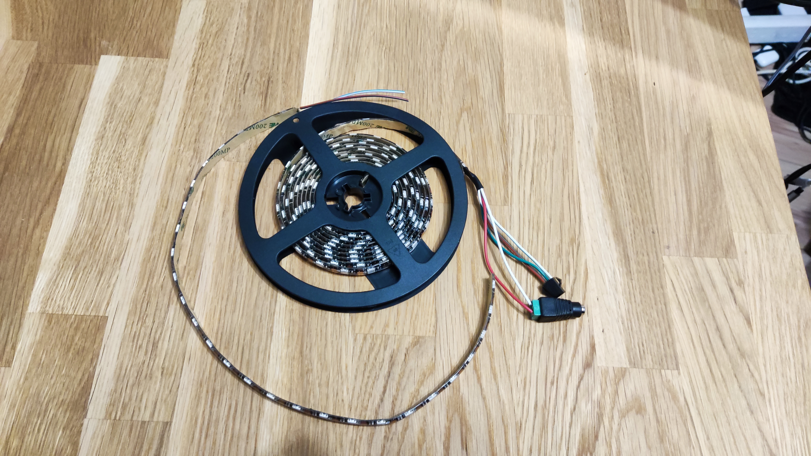

-Zasilacz 5V 10A:

Aby wybrać odpowiedni zasilacz potrzebujemy najpierw znać parę rzeczy, takie jak: wymagane napięcie diody, jakie jest jej zapotrzebowanie prądowe. 
Ze strony producenta wiemy, że wymagane napięcie wynosi 5V. Natomiast aby obliczyć zapotrzebowanie prądowe należe posłużyć się informacją, że
te ledy dla 60diód na metr potrzebują 18W. Wymiary naszej taśmy to około 2.3m, co daje nam 18*2.3= 41.4W, gdzie przy napięciu 5V potrzebować będziemy 
co najmniej zasilacza o natężeniu 41.4/5=8.28A, należy wybierać zasilacz z zapasem, dlatego wybrałem zasilacz o napięciu 5V i 10A.

[Link zasilacz](https://www.amazon.pl/gp/product/B083QNN7Z7/ref=ox_sc_act_title_1?smid=A35F3I9APUKQP4&psc=1)

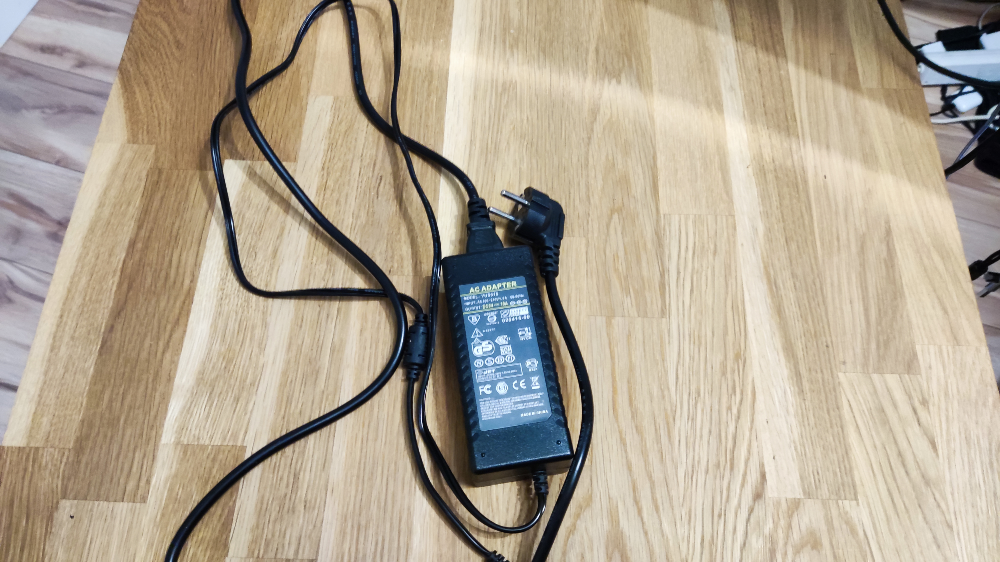

-Wtyk DC damski:

Aby zasilić nasze ledy, będziemy potrzebować wtyku DC, który pozwoli nam za pomocą przewodów podłączyć zasilacz do ledów oraz Arduino.

[Link wtyk DC](https://allegro.pl/oferta/wtyk-dc-5-5mm-x-2-1mm-damski-10661156959)

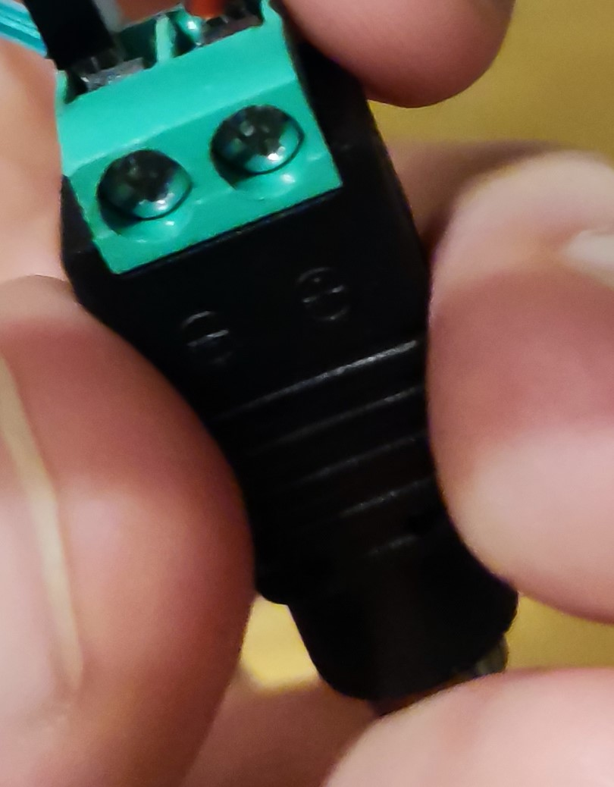

-Złączki taśmowe:

Ostatnie co nam będzie potrzebne to złączki taśmowe 90 stopni, które pozwolą nam połączyć paski ledów bez potrzeby lutowania.

[link złączki](https://allegro.pl/oferta/zlaczka-katowa-tasma-argb-3pin-led-10mm-10537936829?reco_id=e1381319-56f4-11ec-a45c-e43d1a028500&sid=3ec404f37aa2fad6253fa5dd6bb023427743f77ee2f01bb84454c4701b8c0118)


#Schemat projektu w Eagle:

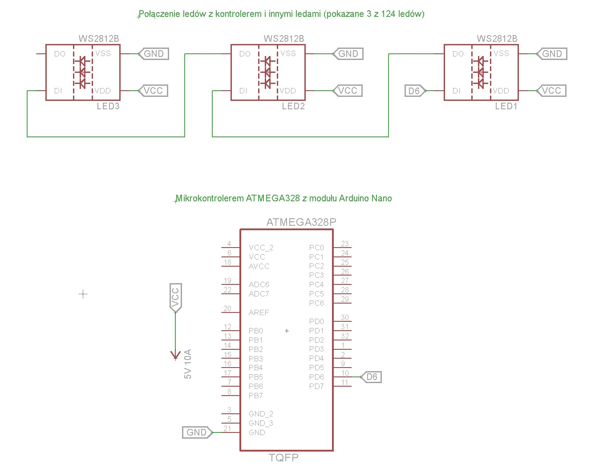

#Budowa i dalszy opis projektu

Najpierw należy odmierzyć pasek ledów, tak aby na górze i po bokach był jeden cały pasek, a na dole monitora były dwa paski o mniej więcej takiej samej długości aby było miejsce na podłączenie wszystkiego do arduino.

Następnie móżna przystąpić do klejenia ledów do wcześniej wyczyszczonego monitoram paski ledowe mają na sobie klej co ułatwia montaż. Podczas montażu posłużymy się również złączkami, których zasada działania jest banalnie prosta:

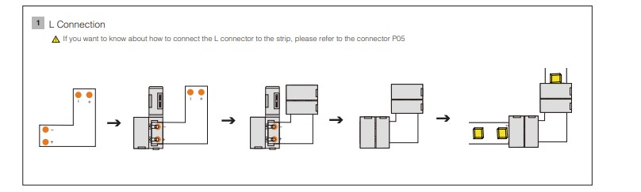

Tak przebiegały etapy montowania Ledów:

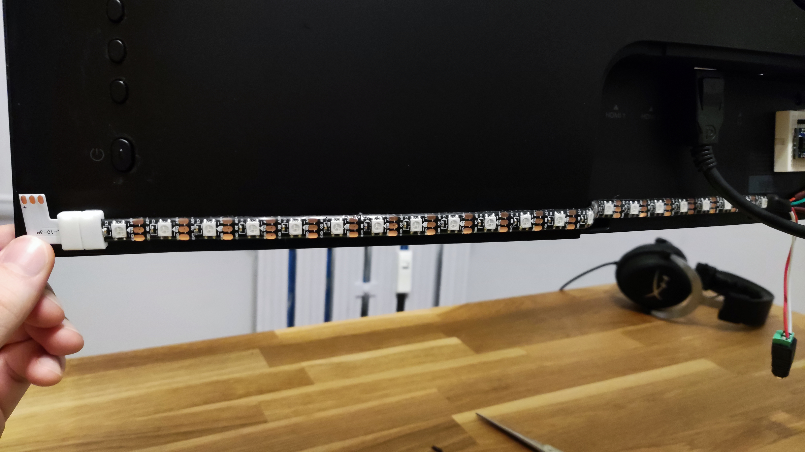

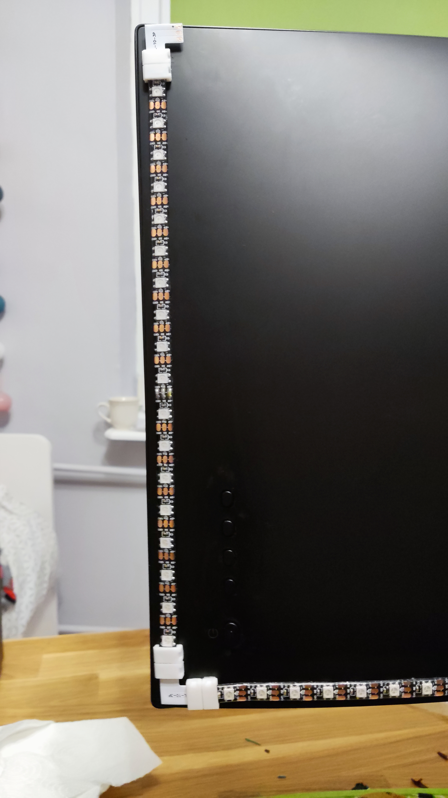

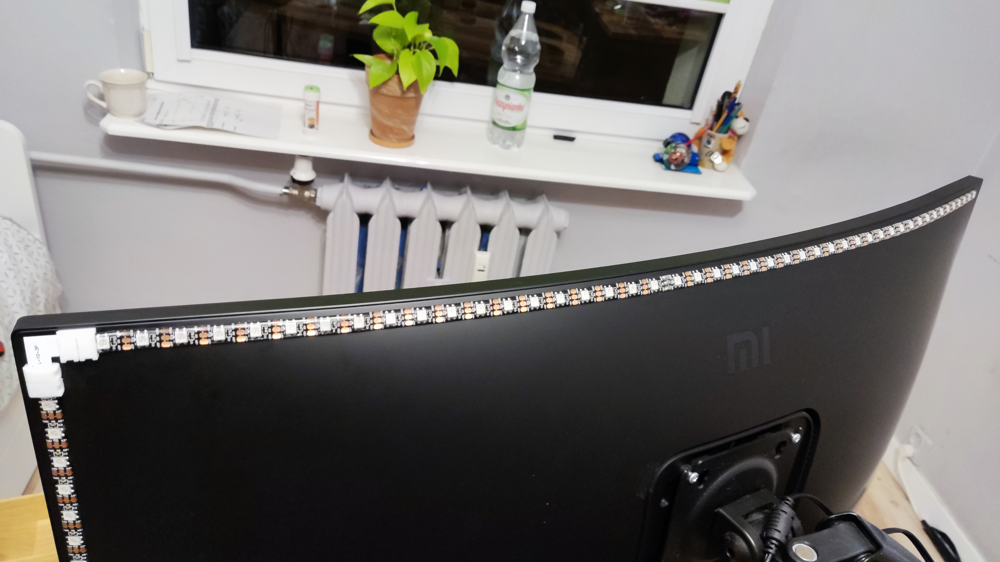

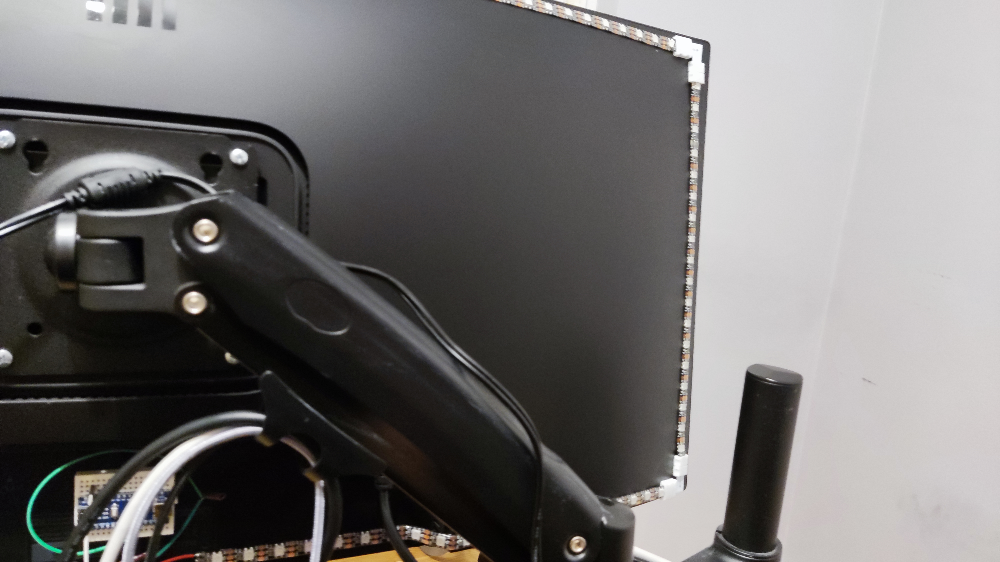

Będziemy używać Arduino Nano z mikrokontrolerem ATMEGA328

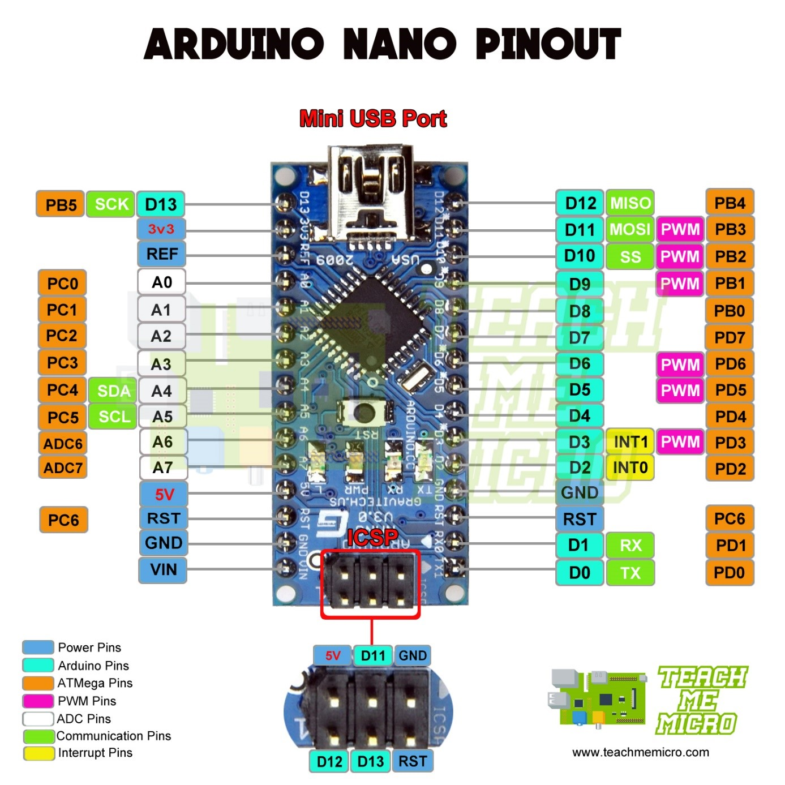

Poprzez kabel Usb łączymy Arduino z naszym komputerem, do Pina D6 podłączamy na płytce stykowej przewód, który następnie będziemy musieli połączyć ze środkowym przewodem w ledach z jednej strony, jest to przewód przez który będziemy wydawać rozkazy ledom

Do GND podłączamy przewód, który razem z dwoma przewodami GND z ledów łączymy we wtyku DC.

Do Plusa we wtyku DC łączymy przewody oznaczone 5V z ledów i następnie zaciskamy przewody dokręcając w miejsach na śrubokręt.

Poniżej zilustrowanie tego jak powinno to wszystko wyglądać:

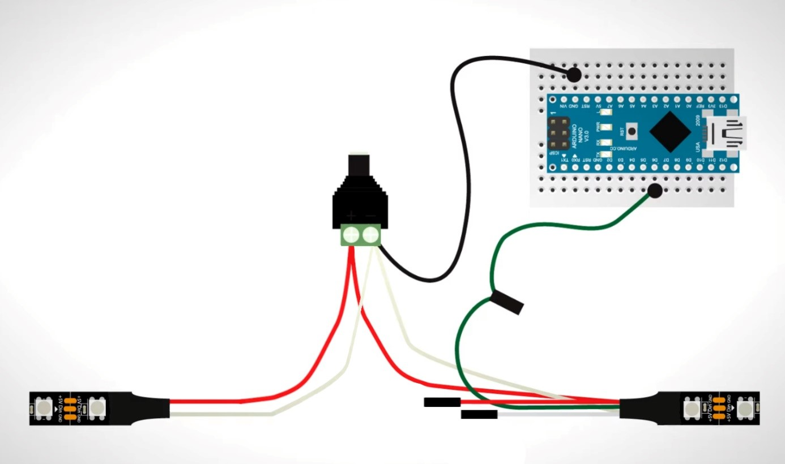

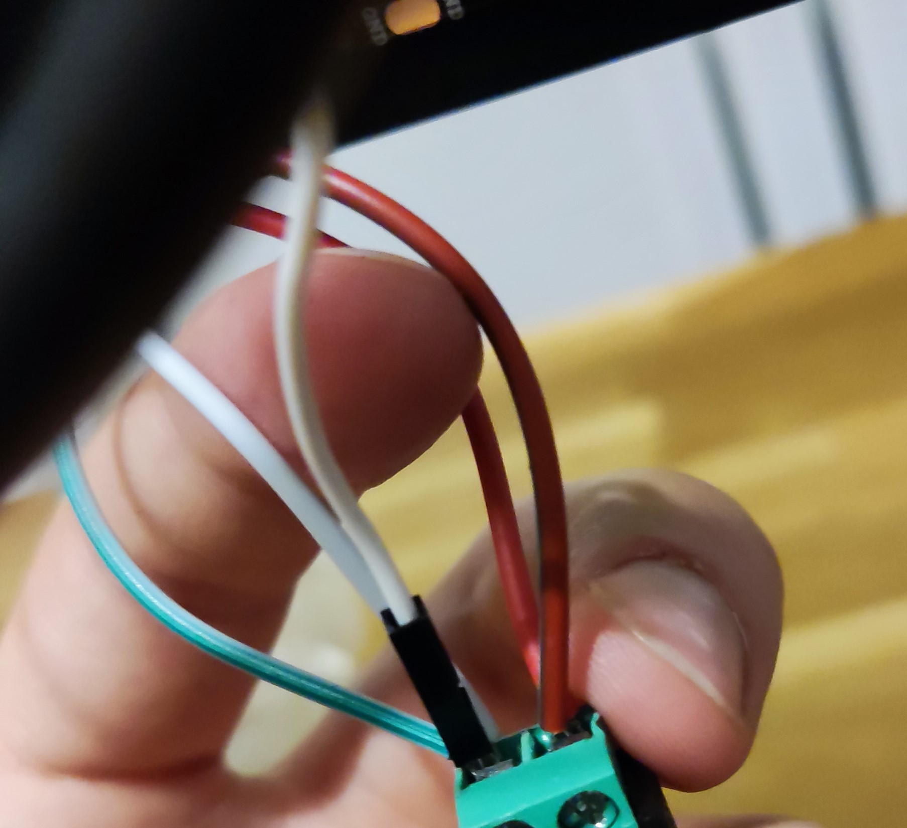

Płytkę stykową można przkleić na taśmę dwustronną do tyłu monitora. Tak będzie wyglądać wszystko podłączone:

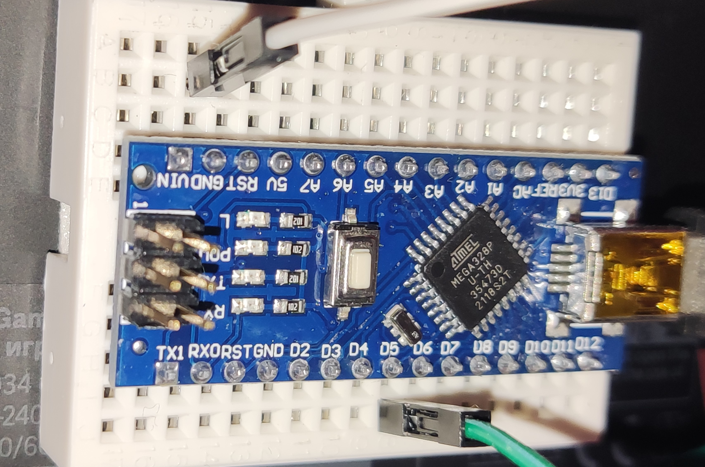

Widok ogólny:

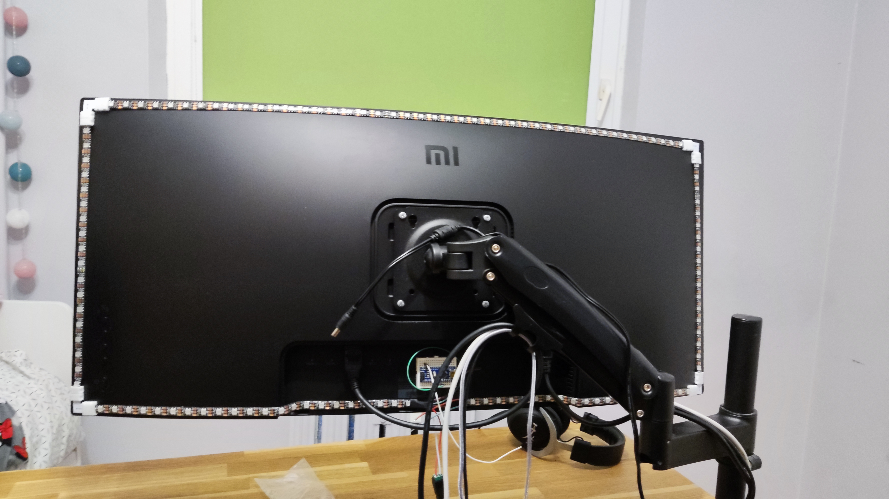


#Kod pięcu trybów ledów wraz z opisem:

```cp
#include <FastLED.h>    //załączamy bibliotekę FastLED, ponieważ po  
#define LED_PIN 6   //definiujemy Pina z którego bedą wysyłane sygnały, w tym przypadku jest do pin D6
#define NUM_LEDS 124    //podajemy tutaj liczbę ledów, których łącznie jest 124

CRGB leds[NUM_LEDS];    //chcemy aby nasze ledy były definiowane w przestrzeni RGB, w tym przypadku akurat GRB, gdzie trzy jednobajtowe wartości od 0-255 będą definiować kolor ledów 

void setup() {    //w tym voidzie zainicjujemy ledy i ustalimy podstawowe wartości, takie jak jasność ledów, 
  FastLED.addLeds<WS2812B, LED_PIN, RGB>(leds, NUM_LEDS);
  FastLED.clear();    //komenda, która czyści ledy, czyli ustawia na nich wartości (0, 0 ,0). czyli kolor czarny - wygaszenie ledów
  FastLED.show();   //komenda, która odświeża ledy, czyli jeżeli za pomocą kodu zmieniliśmy wartość kolorów ledów, to dzięki niej te zmiany "wejdą w życie" 
  Serial.begin(9600);   //ustawiamy szybkość transmisji danych w bitach na sekundę dla szeregowej transmisji danych.
  FastLED.setBrightness(255);   //janość ledów na maksa
  randomSeed(analogRead(0));    //za pomocą tej komendy określamy skąd są pobierane dane do generatora liczb losowych,
}

////////////////////////////////////////////////////////////////////////////////////////////////////////////////////////////////////

void Policja() {    //to jest funkcja, za pomocą której zamieniamy sie w policjantów, a nasz monitor to radiowóz,
for (int i=0; i<NUM_LEDS; i++) {
    leds[(NUM_LEDS/2)+i] = CRGB(0,0, 255); //GRB    w pierwszych trzech linijkach widać, że dzielimy ledy na pół, ponieważ chcemy zacząć kolor od góry
    leds[(NUM_LEDS/2)+i+1] = CRGB(0,0, 255); //GRB    mamy tutaj 3 linijki aby kolor nie szedł tylko z jednego leda na raz ale z trzech
    leds[(NUM_LEDS/2)+i+2] = CRGB(0,0, 255); //GRB    kolor niebieski będzie obiegać monitor ze środka na lewą stronę
    
    leds[(NUM_LEDS/2)-i] = CRGB(0, 255, 00); //GRB    w drugiej połowie odejmujemy zmienną zamiast ją dodawać, co spowoduje że kolor czerwony pójdzie w drugą stronę 
    leds[(NUM_LEDS/2)-i-1] = CRGB(0, 255, 00); //GRB
    leds[(NUM_LEDS/2)-i-2] = CRGB(0, 255, 00); //GRB    
    
    FastLED.show();   //po każdej pętli ledy się aktualizują
    delay(1);
    FastLED.clear();    //po malutkim opóźnieniu ledy sie czyszczą
 } 
}

////////////////////////////////////////////////////////////////////////////////////////////////////////////////////////////////////

void RainbowSpin() {    //za pomocą tej funkcji zmieniamy się w fanatyków LGBT i za ekranem kręci się tęcza, która zatacza kółka i z każdą rotacją zmienia kolor na następny kolor w tęczy
// Czerwony
for (int i=0; i<NUM_LEDS; i++ ) {
    leds[i] = CRGB(0, 255, 0); //GRB
    delay(1);
    FastLED.show();
}
// Pomarańczowy   nie musimy tutaj czyscic ledów bo i tak nowy kolor będzie się nadpisywał na stary
for (int i=0; i<NUM_LEDS; i++ ) {
    leds[i] = CRGB(80, 255, 0); //GRB
    delay(1);
    FastLED.show();
}
// Żółty
for (int i=0; i<NUM_LEDS; i++ ) {
    leds[i] = CRGB(150, 255, 0); //GRB
    delay(1);
    FastLED.show();
}
// Zielony
for (int i=0; i<NUM_LEDS; i++ ) {
    leds[i] = CRGB(255, 0, 0); //GRB
    delay(1);
    FastLED.show();
}
// Niebieski
for (int i=0; i<NUM_LEDS; i++ ) {
    leds[i] = CRGB(170, 0, 255); //GRB
    delay(1);
    FastLED.show();
}  
// Fioletowy
for (int i=0; i<NUM_LEDS; i++ ) {
    leds[i] = CRGB(0, 75, 110); //GRB
    delay(1);
    FastLED.show(); 
}
}
////////////////////////////////////////////////////////////////////////////////////////////////////////////////////////////////////


void RainbowPong() {    //tutaj jest podobnie tak samo jak w poprzednim RainboSpin, ale w tym przypadku zamiast zataczać pełne koło, to kolor będzie się odbijał jak skończą mu sie ledy
// Czerwony
for (int i=0; i<NUM_LEDS; i++ ) {
    leds[i] = CRGB(0, 255, 0); //GRB
    delay(2);
    FastLED.show();
}
// Pomarańczowy
for (int i=NUM_LEDS-1; i>0; i-- ) {   //jedyna zmiana w tym trybie to jest w pętli for, co powoduje, że ledy zapalają się od końca do początku
    leds[i] = CRGB(80, 255, 0); //GRB
    delay(2);
    FastLED.show();
}
// Żółty
for (int i=0; i<NUM_LEDS; i++ ) {
    leds[i] = CRGB(150, 255, 0); //GRB
    delay(2);
    FastLED.show();
}
// Zielony  
for (int i=NUM_LEDS-1; i>0; i-- ) {   //i taką zmianę stosujemy w co drugiej pętli
    leds[i] = CRGB(255, 0, 0); //GRB
    delay(2);
    FastLED.show();
}
// Niebieski
for (int i=0; i<NUM_LEDS; i++ ) {
    leds[i] = CRGB(170, 0, 255); //GRB
    delay(2);
    FastLED.show();
}  
// Fioletowy
for (int i=NUM_LEDS-1; i>0; i-- ) {
    leds[i] = CRGB(0, 75, 110); //GRB
    delay(2);
    FastLED.show();
} 
}

////////////////////////////////////////////////////////////////////////////////////////////////////////////////////////////////////

void Epilepsja() {    //tutaj mamy niebezpieczną pętlę, do której idealnie przydadzą nam się losowe liczby
leds[random(NUM_LEDS)] = CRGB(random(255), random(255), random(255));   //losowa dioda led zapali się na losowy kolor
leds[random(NUM_LEDS)] = CRGB(random(255), random(255), random(255));   //i kolejna zrobi tak samo i tak dalej
leds[random(NUM_LEDS)] = CRGB(random(255), random(255), random(255));   
leds[random(NUM_LEDS)] = CRGB(random(255), random(255), random(255));
leds[random(NUM_LEDS)] = CRGB(random(255), random(255), random(255));
FastLED.show();
delay(20);
FastLED.clear();    //aby nam się szybko nie zapchały ledy to po pięciu takich losowych ledach czyścimy je wszystkie i pojawiają sie na ich miejsce bardzo szybko kolejne, co powoduje efekt migających losowo światełek
}

////////////////////////////////////////////////////////////////////////////////////////////////////////////////////////////////////

int row1[124] = {0,123,1,122,2,121,3,120,4,119,5,118,6,117,7,116,8,115,9,114,10,113,11,112,12,111,13,110,14,109,15,108,16,107,17,106,18,105,19,104,20,103,21,22,100,23,101,24,102,25,97,26,98,27,99,28,94,29,95,30,96,31,91,32,92,33,93,34,88,35,89,36,90,37,85,38,86,39,87,40,84,41,83,42,82,43,81,44,80,45,79,46,78,47,77,48,76,49,75,50,74,51,73,52,72,53,71,54,70,55,69,56,68,57,67,58,66,59,65,60,64,61,63,62};
//tutaj powyżej zdefinowałem tablicę w taki sposób, aby od początku i od końca ledy szły do środka paska ledów w tym samym tempie
void  PionowaPulsacja() {   //PionowaPulsacja, poniważ kolor idzie zamiast z jednej strony na drugą to do pionowo do górę i w dół

for (int i=(NUM_LEDS-1); i>=0; i--){    //I ostani, mój ulubiony tryb ledów. W tej funkcji są dwa rodzaje pętli, pętlam, w której kolor ledów zmienia się i po wypełnieniu znika stopnionwo
 leds[row1[i]] = CRGB(0, 255, 0); //GRB   oraz taki, w której kolor idzie w postaci dwóch "wężyków" o długości dwudziestu ledów
 leds[row1[i+20]] = CRGB(0, 0, 0); //GRB    ta pętla jest dla wersji z wężykiem i widzmy, że w tej pętli czekamy aż pętla przetworzy się dwadzieścia razy aby zacząć wygaszać ledy
    FastLED.show();
    delay(10); 
}
    for (int i=20; i>0; i--){   //ta pętla jest nam potrzebna aby wyłączyć ledy, które zostaną po tym jak wąż dojedzie, ponieważ bez tej pętli, dwadzieścia ledów z obu stron byłoby zapalone cały czas
 leds[row1[i]] = CRGB(0, 0, 0); //GRB   prościej byłoby użyć po prostu comendy FastLED.clear(), ale to zamiast wyłączyć ledy po kolei, na czym nam zależy, to wyłączyłaby je wszyskie za jednym razem
    FastLED.show();
    delay(10); 
}
  delay(100); 
  
for (int i=0; i<NUM_LEDS; i++){   //w tej pętli, nasze ledy z wczesniej zdefiniowanej tablicy odpowiednio się wszystkie zapalą na dany kolor a w następnej pętli, po kolei zgasną
 leds[row1[i]] = CRGB(0, 255, 0); //GRB
    FastLED.show();
    delay(10); 
}
    for (int i=0; i<NUM_LEDS; i++){
 leds[row1[i]] = CRGB(0, 0, 0); //GRB
    FastLED.show();
    delay(10); 
}
  delay(100); 

for (int i=(NUM_LEDS-1); i>0; i--){   //ta pętla jest ta sama co poprzednia, ale tym razem z góry do dołu
 leds[row1[i]] = CRGB(0, 255, 0); //GRB
    FastLED.show();
    delay(10); 
}
    for (int i=(NUM_LEDS-1); i>0; i--){
 leds[row1[i]] = CRGB(0, 0, 0); //GRB
    FastLED.show();
    delay(10); 
}
  delay(100); 

for (int i=0; i<NUM_LEDS; i++){   //a ta pętla jest ta sama jak pierwsza ale również tym razem akurat z dołu do góry
 leds[row1[i]] = CRGB(0, 255, 0); //GRB
 leds[row1[i-20]] = CRGB(0, 0, 0); //GRB
    FastLED.show();
    delay(10); 
}
for (int i=103; i<NUM_LEDS; i++){   //również zostanie nam wąż o długości 20 ledów i aby je zgasić musimy pamiętać, że chcemy zgasić ledy, które są na górze ekranu, czyli na końcu naszej tabeli i dlatego i nadajemy wartość startową 103
 leds[row1[i]] = CRGB(0, 0, 0); //GRB
    FastLED.show();
    delay(10); 
}
delay(100); 
FastLED.clear();
}

////////////////////////////////////////////////////////////////////////////////////////////////////////////////////////////////////

void loop() {   //w tej funkcji wywołujemy już nasze wcześniej przygotowane funckje z trybami ledów
    PionowaPulsacja(); //Do wyboru mamy: RainbowSpin(); RainbowPong(); Epilepsja(); Policja(); PionowaPulsacja;
}
```
Filmik z trybu RainbowSpin():
Link: 

Filmik z trybu RainbowPong():
Link: 

Filmik z trybu Epilepsja():
Link: 

Filmik z trybu Policja():
Link: 

Filmik z trybu PionowaPulsacja():
Link: 


#Alterantywne zastosowanie ledów

Jeszcze jedna bardzo ciekawa możliwość działania tych ledów to jako czujnik koloru Ambilight.

Aby to zrobić, będziemy potrzebować kodu do arduino Adalight_WS2812, w którym będziemy musieli ustawić odpowiedni pin i liczbe ledów oraz programu Prismatik
Menu programu Prismatik, w którym widać że jest on ustawiony na screen capture, czyli w zależności od tego co będzie się wyświetlało na ekranie na jego obwodzie to tak sie zaświecą ledy

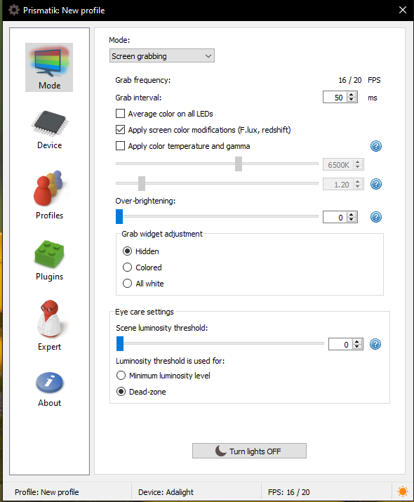

Jedną z opcji podczas konfiguracji jest dobranie strefy dla każdej diody tak aby dany prostokąt jak najbardziej odpowiadał jej położeniu. Im dokładniej się to zrobi tym lepsze będą potem efekty.

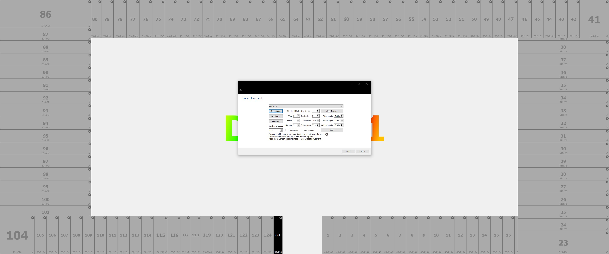

Następnie należy również dobrać odpwiednie wartości dla ledów, tak aby na kolorze naszej ściany światło było jak najbardziej białe:

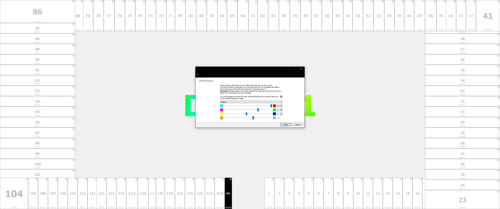

Jeżeli jest to zrobione to możemy raczyć się niesamowitymi efektami świetlnymi w grach oraz podczas korzystania z youtube :)

Filmik z domowej roboty Ambilight :

#Napotkane problemy

-Ledy nie gasną przy wyłączeniu się komputera:

Rozwiązanie: dokupiłem Huba Usb z przyciskiem, do którego jest podłączony mikrokontroler, ponieważ jedyny sposób na zresetowanie ledów po wyłączeniu komputera to odpięcie i podpięcie kabla to o wiele wygoniejsze jest po prostu pstryknięcie przycisku.


[Link Rozdzielacz](https://allegro.pl/oferta/hub-usb-3-0-rozdzielacz-4-porty-usb-rozgaleznik-10569869994?snapshot=MjAyMS0xMi0xM1QxMzozMTozMi42NTlaO2J1eWVyOzI4NjBmMGFkZTRlNmI3MmMzODY1YTg4NTAzNDZiYTBiZWFmNWRjNmUyNGVmMTM0YmFlYmNmODg1MDFkMmYyZGI%3D)

-Po odłączeniu i podłączeniu mikrokontrolera, program prismatik przestaje działać i należy go zresetować.

Rozwiązanie: tutaj również rozwiązanie jest tylko półśrodkiem, ponieważ polega na napisaniu krótkiego kodu w powershellu i zbindowania go pod jakiś klawisz myszki, aby był łatwo i szybko dostępny bez potrzeby minusowania tego co się robiło i kasowania i odpalania na nowo programu.

Kod prezentuje się następująco:

```cp
Set-Location -Path C:\Users\doncz\Desktop\Programy
Stop-Process -Name "Prismatik" -force
Start-Process -FilePath "Prismatik"
```
Następnie za pomocą programu Razer Synapse, zbindowałem aby na kliknięciu scrolla odpalał się dany program, czyli skrypt w powershellu
